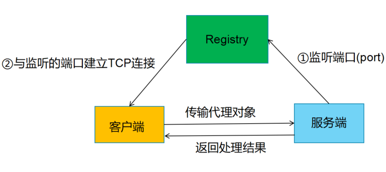

#一.**从0到1的一个简单实现**
RPC(Remote Procedure Call)远程过程调用。<h>

最最最简单的示意图，存在一个公共的接口库，客户端服务端都能访问到。目的是为了调用服务的接口实现类里面的方法

##关键点
明确目的:为了调用服务端'接口实现类'里面的方法，获取其返回值。<h>

1.客户端这边我们并没有接口的具体实现类，就没有办法直接生成实例对象，可以使用动态代理的方式。<h>

2.客户端/服务端之间的远程交互，需要通过网络进行(序列化)<h>

3.实现类中可能存在方法重载，为了唯一确定目标方法(接口名，方法名，参数名，参数类型)以上四个字段就可做到<h>

4.服务端处理完请求以后，需要有返回值给客户端存在两种可能:<h>

  1.失败，返回失败信信息<h>
  
  2.成功，返回数据
##实现步骤
1.创建公共接口库，rpc-api，提供一个接口HelloService其中提供一个hello方法，并传递一个HelloObject对象<h>

2.在服务端实现这个接口，HelloServiceImpl<h>

3.为什么要定义一个**传输协议**<h>
 * 唯一确定一个方法
 * 客户端向服务端传递对象时，服务端的公共接口实现类中可能存在多个同名方法，即存在**方法重载**，因此，仅靠方法名无法唯一确定具体的方法，因此必须将方法的参数和参数类型同时发送过去。<h>
 综上可以确定传输协议包含的属性必须有:<h>
 
 
 ①接口名InterfaceName<h>
 
 ②方法名MethodName<h>
 
 ③传递的参数param<h>
 
 ④参数的类型paramType<h>
 ```java
public class RpcRequest implements Serializable {
     /**
      * 待调用接口名称
      */
     private String interfaceName;
     /**
      * 待调用方法名称
      */
     private String methodName;
     /**
      * 待调用方法的参数
      */
     private Object[] parameters;
     /**
      * 待调用方法的参数类型
      */
     private Class<?>[] paramTypes;
 }
```
4.确定服务端返回内容<h>

 *成功调用服务，获取方法返回数据。<h>
 
 *失败，返回失败信息。<h>
客户端的输出流经过网络传输给服务端(即客户端的输出流对赢服务端的输入流，服务端的输出流对象客户端的输入流)<h>

5.构建服务端，并利用ServerSocket监听与客户端发出请求的一致端口，当客户通过这个端口，
发送请求时，服务端就会新建一个线程<h>
这里就会出现一个问题，每发一个请求就会新建一个线程，发送多次就会创建多个线程。


6.构建客户端，客户端需要主动构造与服务器连接的Socket，
并使用动态代理构造HelloService的代理类对象，封装以后序列化通过传输给服务端

